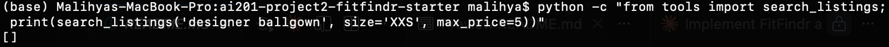
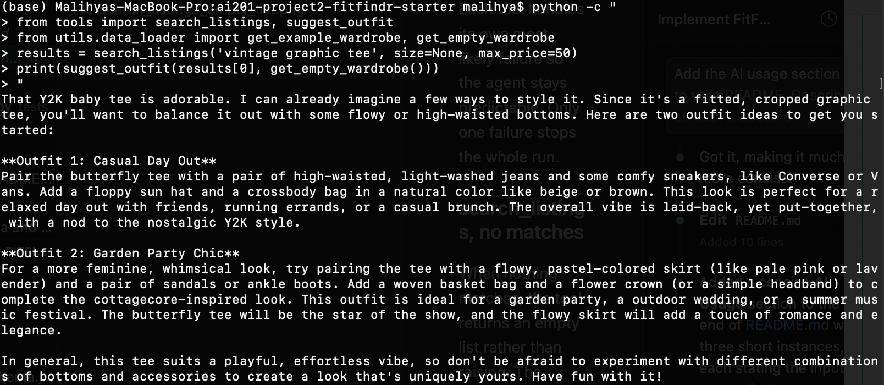
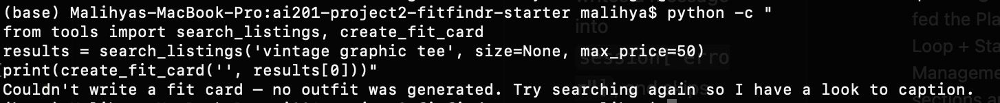

# FitFindr — Starter Kit

This starter kit contains everything you need to begin Project 2.

## What's Included

```
ai201-project2-fitfindr-starter/
├── data/
│   ├── listings.json          # 40 mock secondhand listings
│   └── wardrobe_schema.json   # Wardrobe format + example wardrobe
├── utils/
│   └── data_loader.py         # Helper functions for loading the data
├── planning.md                # Your planning template — fill this out first
└── requirements.txt           # Python dependencies
```

## Setup

```bash
pip install -r requirements.txt
```

Set your Groq API key in a `.env` file (get a free key at [console.groq.com](https://console.groq.com)):
```
GROQ_API_KEY=your_key_here
```

## The Mock Listings Dataset

`data/listings.json` contains 40 mock secondhand listings across categories (tops, bottoms, outerwear, shoes, accessories) and styles (vintage, y2k, grunge, cottagecore, streetwear, and more).

Each listing has: `id`, `title`, `description`, `category`, `style_tags`, `size`, `condition`, `price`, `colors`, `brand`, and `platform`.

Load it with:
```python
from utils.data_loader import load_listings
listings = load_listings()
```

## The Wardrobe Schema

`data/wardrobe_schema.json` defines the format your agent uses to represent a user's existing wardrobe. It includes:

- `schema`: field definitions for a wardrobe item
- `example_wardrobe`: a sample wardrobe with 10 items you can use for testing
- `empty_wardrobe`: a starting template for a new user

Load an example wardrobe with:
```python
from utils.data_loader import get_example_wardrobe
wardrobe = get_example_wardrobe()
```

## Where to Start

1. **Read `planning.md` and fill it out before writing any code.**
2. Verify the data loads correctly by running `python utils/data_loader.py`.
3. Build and test each tool individually before connecting them through your planning loop.

Your implementation files go in this same directory. There's no required file structure for your agent code — organize it however makes sense for your design.

# FitFindr Agent Documentation

## Tool Inventory

FitFindr uses three tools. Each one is a standalone function in `tools.py` that can be called and tested on its own before the agent wires them together.

### search_listings

**Purpose:** Find secondhand items that match what the user asked for. This is the only tool that reads the dataset, and its result decides whether the rest of the run happens at all.

**Inputs:**
1. `description` (str): keywords describing the item, for example "vintage graphic tee".
2. `size` (str or None): a size to filter by, or None to skip size filtering. Matching is case insensitive.
3. `max_price` (float or None): a price ceiling that is inclusive, or None to skip price filtering.

**Output:** a list of listing dicts sorted best match first. Each dict has `id`, `title`, `description`, `category`, `style_tags`, `size`, `condition`, `price`, `colors`, `brand`, and `platform`. Returns an empty list when nothing matches. It never raises.

### suggest_outfit

**Purpose:** Turn a found item into wearable outfit ideas. It adapts based on whether the user has a wardrobe on file.

**Inputs:**
1. `new_item` (dict): one listing dict, the item the user is considering.
2. `wardrobe` (dict): a wardrobe dict with an `items` key holding a list of owned pieces. May be empty.

**Output:** a non empty string of outfit ideas. When the wardrobe has items, the ideas name real pieces the user owns. When the wardrobe is empty, it returns general styling advice instead.

### create_fit_card

**Purpose:** Write a short, shareable social media caption for the find, so the output feels like a real post rather than a product page.

**Inputs:**
1. `outfit` (str): the outfit suggestion produced by suggest_outfit.
2. `new_item` (dict): the listing dict for the item, used for its title, price, and platform.

**Output:** a 2 to 4 sentence caption string. If the outfit input is empty or only whitespace, it returns a short error message string instead of calling the model.

## Planning Loop

The planning loop lives in `run_agent` in `agent.py`. It is a fixed, linear sequence rather than a model that chooses tools freely, because the order of the three tools is always the same and each step depends on the one before it.

The important part is the decisions the agent makes, not just the calls:

**Decision 1, how to read the query.** The agent first parses the raw text with `_parse_query`. This uses simple pattern matching to pull out a size (for example "size M") and a price ceiling (for example "under $30" becomes 30.0), and treats whatever text is left as the search description. The choice to parse with patterns instead of asking the model keeps this step fast, free, and predictable, and it stores the result in `session["parsed"]`.

**Decision 2, whether to continue at all.** After `search_listings` runs, the agent looks at how many results came back. This is the one real branch in the whole loop. If the list is empty, the agent stops here. It writes a helpful message into `session["error"]` and returns immediately, so the two model based tools never run on empty input. If the list has matches, the agent picks the top ranked result as `session["selected_item"]` and keeps going.

**Decision 3, what kind of outfit advice to give.** This decision is delegated to `suggest_outfit`, which checks whether the wardrobe has items and either names real pieces or gives general advice. The planning loop does not need to know which path was taken, it just passes the selected item and the wardrobe in and stores whatever string comes back.

**Decision 4, whether the caption is safe to write.** `create_fit_card` guards against an empty outfit string before calling the model. In normal runs the outfit is always present, but this guard means a failure upstream produces a clear message instead of a broken caption.

The loop knows it is done when `create_fit_card` returns and the completed session is handed back. There is no looping or re entry. The agent never asks the user a follow up question in the middle of a run.

## State Management

All information for one interaction lives in a single `session` dict created by `_new_session` at the start of the run. The tools never call each other. The planning loop reads each tool's input out of the session and writes each tool's output back into the session before the next call. This keeps one clear source of truth and makes the data flow easy to follow.

The session tracks the original `query`, the `parsed` filters, the `search_results` list, the `selected_item`, the `wardrobe`, the `outfit_suggestion`, the `fit_card`, and an `error` field that stays None unless the run ended early.

The flow is direct. `search_listings` fills `search_results`, then the loop sets `selected_item` to the first result. `suggest_outfit` reads `selected_item` and `wardrobe` and fills `outfit_suggestion`. `create_fit_card` reads `outfit_suggestion` and `selected_item` and fills `fit_card`. The same item object that comes out of search is the same object passed into both later tools, so nothing is copied, re fetched, or hardcoded between steps. The caller checks `session["error"]` first to know whether the run succeeded.

## Error Handling

Each tool handles its own most likely failure so the agent stays predictable. Only one failure stops the whole run.

### search_listings, no matches

When nothing matches, the tool returns an empty list rather than raising. The planning loop treats this as a stop condition, writes a message into `session["error"]`, and skips the other two tools.

**Concrete example from testing.**



### suggest_outfit, empty wardrobe

When `wardrobe["items"]` is empty, the tool does not fail or return a blank string. It switches to general styling advice for the item on its own. The planning loop does not need special handling, it always receives a usable outfit string.



### create_fit_card, missing outfit

The tool checks for an empty or whitespace only outfit string before calling the model. If it finds one, it returns a short message such as "Couldn't write a fit card — no outfit was generated" instead of producing a broken caption. This protects the final step if anything upstream produced nothing.



## Spec Reflection

The build follows `planning.md` closely. The three tools, the linear loop, the single session dict, and the early exit on empty results all match the plan. Writing the spec first helped because each step already had a clear input, output, and failure behavior.

The implementation also diverged in one place. The plan expected "vintage graphic tee under $30" to return a Y2K Baby Tee first, but the top result was a bootleg graphic tee. This happens because the search matches keywords as plain substrings and keeps very short words, so common letters match many listings and add noise to the ranking. The agent still behaves correctly, but the scoring is the clearest thing to improve next.

## AI Usage

I used Claude as a coding assistant. Specific instances are below.

**Instance 1, planning loop in agent.py.** I gave it the Planning Loop and State Management sections plus the Architecture diagram from `planning.md` and the existing stubs. It produced the full loop and an extra `_parse_query` helper. I kept the helper but reviewed the loop myself to confirm it branches on the search result, stores values in the session, and does not call all three tools unconditionally.

**Instance 2, handle_query in app.py.** I gave it the numbered TODO steps and the listing dict fields. It produced the handler with an empty query guard, wardrobe selection, the `run_agent` call, and error and success branches. I reformatted the listing text so the title, price, platform, size, and condition read cleanly across lines.

**Instance 3, verifying state flow.** I asked it to prove state passes by reference using my walkthrough query. It wrote a script that checks by object identity that the selected item is the same object passed into both later tools. I had it also print the full list of found listings, and reviewing that output is what surfaced the search ranking issue noted above.
